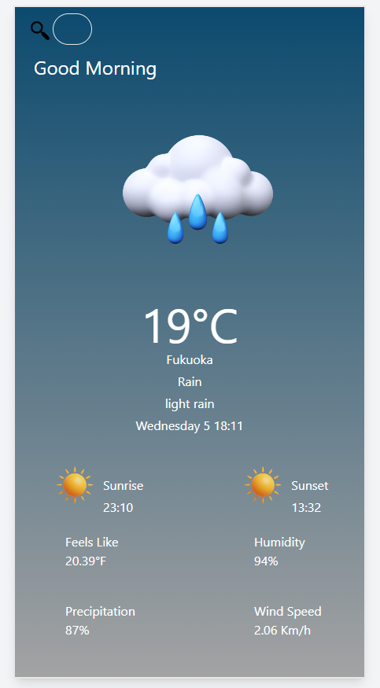
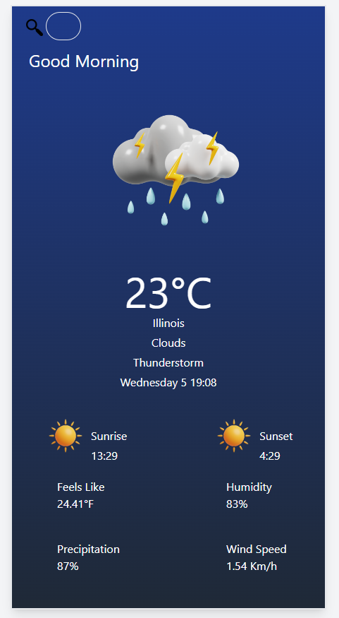

# Weather App 🌤️

This React-based weather application allows users to check the current weather conditions of any desired location. The app dynamically changes background color and images based on the weather: sunny days display a sunny background with clear skies, while rainy days show a cloudy background with rain clouds.

  ## Demo  🌐
 [weather-app.netlify.app](https://weather-app-wap.netlify.app) 

## Screenshots 📸
<div style="display: flex; flex-direction: row;">
    
    
    
</div>


## Features 🌟

- 🖥️ User-friendly interface
- 🧩 Component-based architecture
- 🌐 State management and updates
- 🚀 Usage of React Hooks
- 🔔 Error notifications powered by Notistack


## Technologies Used 💻

- 💻 [React.js](https://reactjs.org/) - JS library for crafting user interfaces
- 📦 [Vite](https://vitejs.dev/) - Module bundler
- 🎨 [Tailwind CSS](https://tailwindcss.com/) - A utility-first CSS framework
- 🌐 [Netlify](https://www.netlify.com/) - Hosting service for static web apps
- 🔔 [Notistack](https://notistack.com/) - React library which makes it super easy to display notifications on your web apps

## Install & Build 🔧

Prerequisites

- Install Node.js ⚙️
- Clone the repo 🔄

📦 After cloning the repo install dependecies with


 ```sh 
  npm i
```
 **Creating the .env File:** ⚙️
   - Start by copying the `.env.example` file and creating a new file named `.env`.
   - Make sure to fill in the contents of the `.env` file.

 ```sh 
  VITE_SOME_KEY=myapikey
  VITE_SOME_BASE=myapibase

```
 -  Import the `.env` file to where you use it
 ```sh 
  const { VITE_SOME_KEY, VITE_SOME_BASE } = import.meta.env;

```

📡 To run development server use dev script
 ```sh 
  npm run dev
```
🔧 To build use build script
 ```sh 
  npm run build
```
after running scripts go to `http://localhost:5173` with your browser to use the app. 🌐


## License 📄

[MIT](https://choosealicense.com/licenses/mit/)
